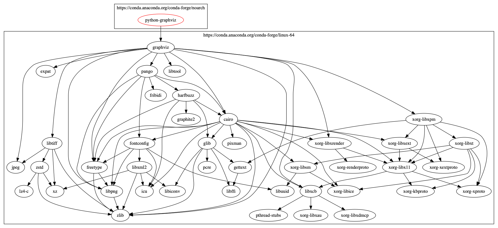

# Conda Dependenies

This is a tool to help vizualize conda dependencies without having to create a cond environment.

The results of this tool are not always 100% accurate since there is no full conda solve, but the results are useful in some cases such as when the conda solver has conflicts.

## Install

`conda install -c raydouglass conda-dependencies`

## Usage

```
usage: conda-dependencies [-h] [-c CHANNEL] [-i PKG] [--hl PKG] [-v]
                          [-g ENGINE]
                          package version output

positional arguments:
  package
  version
  output

optional arguments:
  -h, --help            show this help message and exit
  -c CHANNEL, --channel CHANNEL
  -i PKG, --ignore PKG  Ignore packages (such as libgcc-ng, libstdcxx-ng, or
                        python)
  --hl PKG, --highlight PKG
                        Highlight packages in blue
  -v, --verbose
  -g ENGINE, --graph ENGINE
                        Which graphviz engines to use (dot, fdp, circo, twopi,
                        etc). Defaults to dot
```

## Example

`conda-dependencies -c conda-forge -i libgcc-ng -i libstdcxx-ng -i python python-graphviz 0.14 graph --help`

### Output
```
Package not found: python-graphviz=0.14[subdir=linux-64]
python-graphviz => {'0.14'}
graphviz => {None}
python => {None, '>=2.7'}
cairo => {'>=1.16.0,<1.17.0a0'}
expat => {'>=2.2.5,<2.3.0a0'}
freetype => {'>=2.9.1,<3.0a0'}
jpeg => {'>=9c,<10a'}
libgcc-ng => {'>=7.5.0', '>=4.9', '>=7.3.0'}
libpng => {'>=1.6.35,<1.7.0a0', '>=1.6.37,<1.7.0a0'}
libstdcxx-ng => {'>=7.5.0', '>=4.9', '>=7.3.0'}
libtiff => {'>=4.1.0,<5.0a0'}
libtool => {None}
libxcb => {None, '1.*'}
pango => {'>=1.42.4,<1.43.0a0'}
xorg-libxpm => {None}
xorg-libxrender => {None}
zlib => {'>=1.2.11,<1.3.0a0'}
fontconfig => {'>=2.13.1,<3.0a0'}
glib => {'>=2.58.3,<3.0a0'}
icu => {'>=67.1,<68.0a0', '>=64.2,<65.0a0', '>=58.2,<59.0a0'}
pixman => {'>=0.38.0,<0.39.0a0'}
xorg-libice => {None, '1.0.*'}
xorg-libsm => {'1.2.*', None}
xorg-libx11 => {'1.6.*', None}
xorg-libxext => {'1.3.*', None}
xz => {'>=5.2.4,<5.3.0a0'}
zstd => {'>=1.4.3,<1.4.4.0a0'}
pthread-stubs => {None}
xorg-libxau => {None}
xorg-libxdmcp => {None}
fribidi => {'>=1.0.5,<2.0a0'}
harfbuzz => {'>=2.4.0,<3.0a0'}
gettext => {'>=0.19.8.1,<1.0a0'}
xorg-libxt => {'1.1.*'}
xorg-xextproto => {None}
xorg-xproto => {None}
xorg-renderproto => {None}
libuuid => {'>=2.32.1,<3.0a0'}
libxml2 => {'>=2.9.8,<2.10.0a0'}
libffi => {'>=3.2.1,<3.3.0a0'}
libiconv => {'>=1.15,<1.16.0a0'}
pcre => {'>=8.44,<9.0a0'}
xorg-kbproto => {None}
lz4-c => {'>=1.8.3,<1.8.4.0a0'}
graphite2 => {None}
Rendering dot...
```
